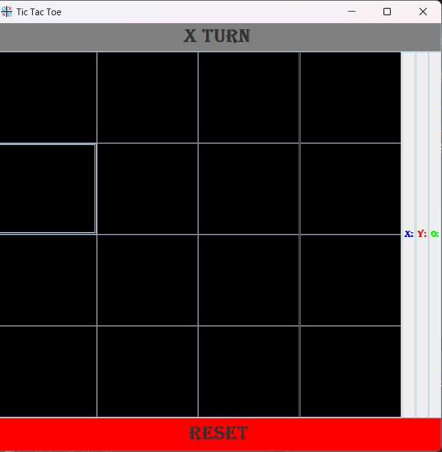
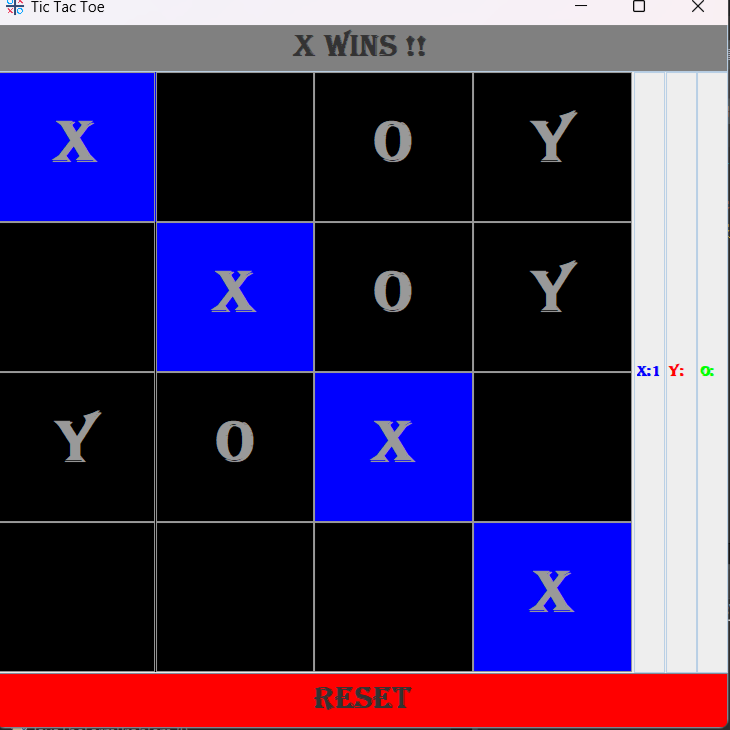
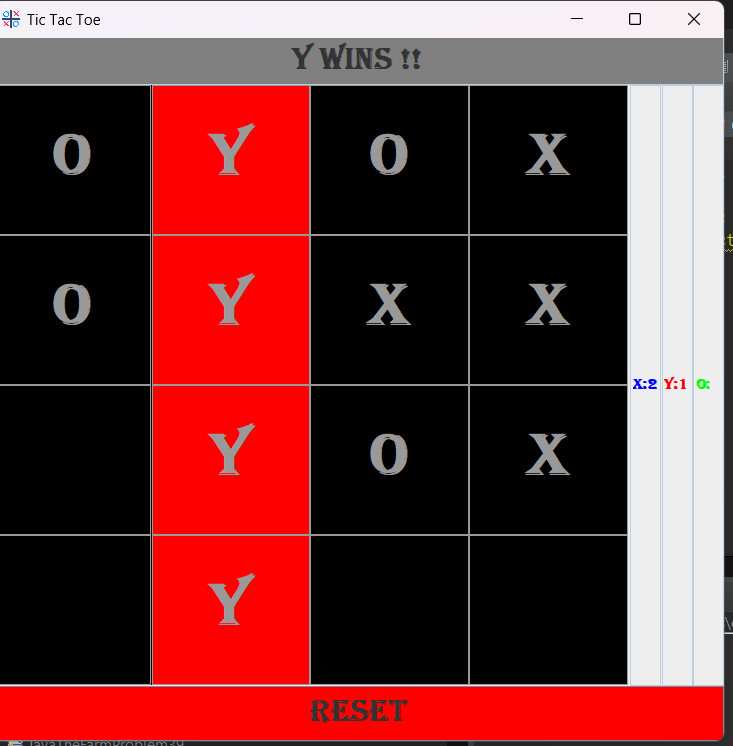
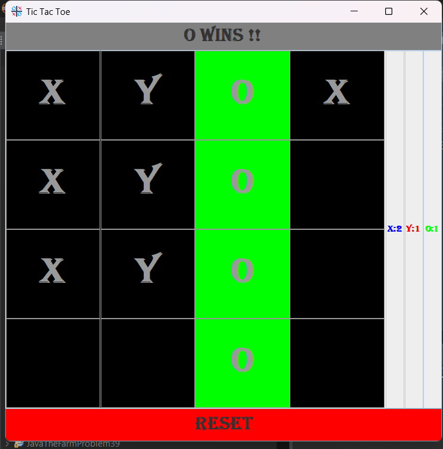

# Tic Tac Toe (3-Player) Project
This is a simple 3-player Tic-Tac-Toe game built using Java GUI.

## Features:
-Playable by 3 players.

-User Friendly,interactive interface.

-Determines the after winner every round,store scores for each player.

-Reset game by using reset button to play the game  again and again.

## How to run: 
1.Clone the repository: `git clone` <https://github.com/Alcom01/TicTacToeFor3Players.git>

2.Open the Project in any IDE(Eclipse,IntelliJ,VS Code etc.)

3.Run the `main` file.

## Screenshots:
* How User Interface looks like initially: 

* How UI looks like after X wins the game: 

* How UI looks like after Y wins the game: 

* How UI looks like after O wins the game: 
